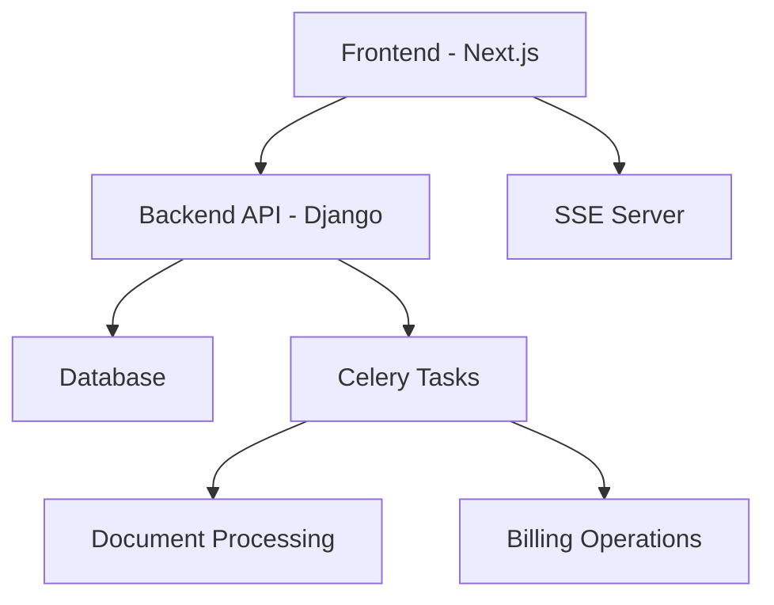
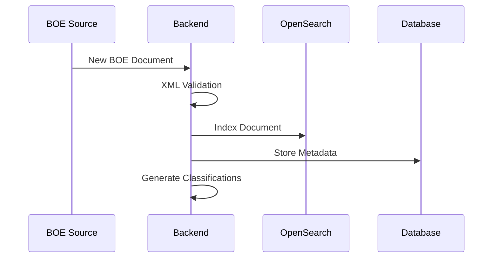
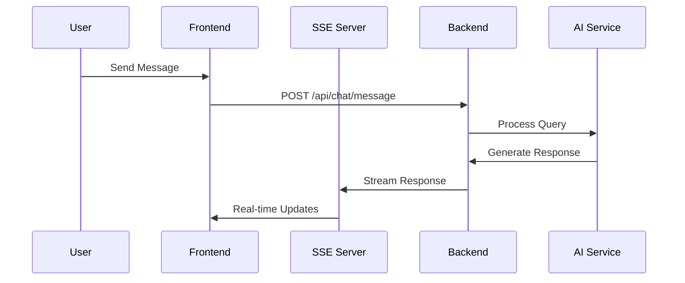

make small files max 300 lines a fileor split large files into function or class base.
always use pre built libraries no raw coding please

we are using express js in backend and we are using pnpm

we are using systemctl to run our servers frontend on port 3000, backend on port 8000 and sse server on port 9000

test user is {"email": "test@example.com", "password": "password123"}

# Technical Documentation and User/Developer Guide

## 1. Overview

ARTISTING is a modern web application that provides an intelligent platform for handling legal and administrative documents, with a focus on Spanish BOE (Boletín Oficial del Estado) processing and analysis. The platform combines document processing, chat functionality, and user management with a subscription-based model.

### Key Objectives
- Process and analyze BOE documents efficiently
- Provide intelligent chat interface for document queries
- Manage user subscriptions and billing
- Offer multi-language support
- Ensure secure user authentication and authorization

### Target Audience
- Legal professionals
- Administrative staff
- Business consultants
- Researchers
- Government officials

## 2. System Architecture

The application follows a modern microservices-based architecture with three main components:

### Frontend (Port 3000)
- Next.js-based React application
- Server-side rendering
- Component-based UI architecture
- Context-based state management

### Backend (Port 8000)
- Django-based REST API
- Celery for asynchronous tasks
- Multiple specialized apps:
  - BOE processing
  - User management
  - Billing
  - Chat
  - Metrics

### SSE Server (Port 9000)
- Server-Sent Events for real-time updates
- Handles chat and notification streaming

### Component Interaction


## 3. Technology Stack

### Frontend
- **Next.js**: React framework for SSR
- **TypeScript**: Type-safe JavaScript
- **TailwindCSS**: Utility-first CSS framework
- **pnpm**: Package manager
- **Lucide**: Icon library
- **shadcn/ui**: UI component library

### Backend
- **Django**: Web framework
- **Django REST Framework**: API development
- **Celery**: Asynchronous task queue
- **Redis**: Cache and message broker
- **OpenSearch**: Document search and indexing
- **PostgreSQL**: Primary database

### DevOps
- **systemctl**: Service management
- **nginx**: Reverse proxy
- **Docker**: Containerization (implied)

## 4. Installation and Setup Guide

### Prerequisites
```bash
# Node.js and pnpm for frontend
node -v  # Should be >= 18
pnpm -v  # Should be >= 8

# Python for backend
python -v  # Should be >= 3.8
```

### Frontend Setup
```bash
cd frontend
pnpm install
pnpm dev  # Development
pnpm build  # Production build
```

### Backend Setup
```bash
cd backend
python -m venv venv
source venv/bin/activate  # Unix
.\venv\Scripts\activate  # Windows
pip install -r requirements.txt
python manage.py migrate
python manage.py runserver
```

### Service Configuration
```bash
# systemctl service files location: /etc/systemd/system/
artisting-frontend.service
artisting-backend.service
artisting-sse.service

# Start services
systemctl start artisting-frontend
systemctl start artisting-backend
systemctl start artisting-sse
```

## 5. Core Features and Functionality

### Application Operation Flow

#### 1. BOE Document Processing Pipeline
1. **Document Acquisition**
   - Automated fetching of BOE (Boletín Oficial del Estado) documents
   - XML document storage in `backend/boe/` directory
   - Support for both real-time and historical BOE documents

2. **Document Processing**
   - XML parsing and validation through `boe/find_xml.py`
   - Metadata extraction using `boe/models.py`
   - Document classification and categorization
   - Storage in OpenSearch for efficient retrieval

3. **Search and Indexing**
   - Full-text indexing via OpenSearch
   - Custom search client implementation in `boe/opensearch_client.py`
   - Real-time document updates and reindexing

#### 2. User Interaction Flow
1. **Authentication Process**
   - User registration/login through Next.js frontend
   - JWT token generation and management
   - Session handling via auth-context
   - Multi-language support through language-context

2. **Credit System**
   - Credit allocation based on subscription tier
   - Credit deduction per document access/query
   - Real-time credit balance updates
   - Automatic notifications for low credits

3. **Chat System Operation**
   - Real-time chat interface via SSE
   - Context-aware document querying
   - Message history tracking in `chat/models.py`
   - Multi-language response generation

#### 3. Billing and Subscription Process
1. **Subscription Management**
   - Tier-based subscription system
   - Credit allocation per tier
   - Automatic renewal processing
   - Usage tracking and analytics

2. **Payment Processing**
   - Secure payment gateway integration
   - Subscription status management
   - Payment history tracking
   - Automatic invoice generation

### Core System Features

#### 1. User Authentication
- JWT-based secure authentication
- Password reset with email verification
- Social authentication support
- Session management with refresh tokens
- Role-based access control

#### 2. Document Processing
- BOE document ingestion and parsing
- XML schema validation and transformation
- Automatic document classification
- Full-text search with highlighting
- Document version control
- Metadata extraction and indexing

#### 3. Chat Interface
- Real-time messaging system
- Context-aware document querying
- Multi-language support (ES/EN)
- Message history with search
- Intelligent response generation
- Stream-based updates via SSE

#### 4. Subscription Management
- Multiple subscription tiers
  - Basic: Limited document access
  - Professional: Full access with higher limits
  - Enterprise: Custom solutions
- Usage tracking and analytics
- Automated billing cycles
- Credit system management
- Payment processing integration

#### 5. Administrative Functions
- User management dashboard
- Document processing monitoring
- System health metrics
- Usage statistics and reports
- Subscription status tracking

## 6. System Operations and Process Flows

### A. Document Processing Operations

#### 1. BOE Document Ingestion


#### 2. Search Operations
- **Full-text Search Process**
  1. User submits search query
  2. Query preprocessing and enhancement
  3. OpenSearch execution
  4. Result ranking and filtering
  5. Response formatting

- **Document Retrieval Process**
  1. Cache check for document
  2. Fetch from OpenSearch if not cached
  3. Permission validation
  4. Credit deduction
  5. Document delivery

### B. User Interaction Flows

#### 1. Chat Operation Process


#### 2. Credit System Operation
1. **Credit Allocation**
   - Initial credit assignment based on subscription
   - Periodic credit refresh (if applicable)
   - Bonus credit distribution

2. **Credit Usage**
   - Document access: -1 credit
   - Advanced searches: -2 credits
   - Chat interactions: -1 credit per query

3. **Credit Monitoring**
   - Real-time balance tracking
   - Low balance notifications
   - Usage analytics

### C. System Integration Points

#### 1. External Service Integration
- Payment Gateway Connection
- Email Service Integration
- Analytics Platform
- Document Storage Services

#### 2. Internal Service Communication
- Redis Message Queue
- Celery Task Distribution
- SSE Event Broadcasting
- Cache Management

## 7. Database and Data Flow

### Key Models
```typescript
// Users
User {
  id: UUID
  email: string
  first_name: string
  last_name: string
  subscription: Subscription
}

// Chat
ChatLog {
  id: UUID
  user: User
  messages: Message[]
  created_at: DateTime
}

// Billing
Subscription {
  user: User
  tier: string
  status: string
  credits: number
}
```

### Data Flow
1. User authentication
2. Document ingestion
3. Processing pipeline
4. Search indexing
5. Chat interaction
6. Analytics collection

## 7. API Endpoints

### Authentication
- POST `/api/auth/login/`
- POST `/api/auth/register/`
- POST `/api/auth/password-reset/`

### Chat
- GET `/api/chat/history/`
- POST `/api/chat/message/`
- GET `/api/chat/stream/` (SSE)

### Documents
- GET `/api/boe/search/`
- GET `/api/boe/document/{id}/`
- POST `/api/boe/process/`

### Billing
- GET `/api/billing/subscription/`
- POST `/api/billing/upgrade/`
- GET `/api/billing/credits/`

## 8. User Guide

### Getting Started
1. Create an account
2. Choose subscription plan
3. Access document search
4. Start chat interactions

### Key Features
- Document search with filters
- Interactive chat interface
- Credit management
- Profile settings
- Language selection

## 9. Developer Guide

### Project Structure
```
frontend/
  ├── app/         # Next.js pages
  ├── components/  # Reusable UI components
  ├── contexts/    # React contexts
  ├── lib/         # Utilities
  └── public/      # Static assets

backend/
  ├── apps/        # Django applications
  ├── ovra_backend/# Core settings
  └── static/      # Collected static files
```

### Development Workflow
1. Fork repository
2. Create feature branch
3. Implement changes
4. Write tests
5. Submit pull request

## 10. Security and Performance

### Security Measures
- JWT authentication
- HTTPS enforcement
- CORS configuration
- Rate limiting
- Input validation

### Performance Optimizations
- Redis caching
- Database indexing
- Asset optimization
- Lazy loading
- Connection pooling

## 11. Future Improvements

### Short-term
- Enhanced search capabilities
- Mobile application
- Additional language support
- Integration with more document sources

### Long-term
- AI-powered document analysis
- Browser extension
- API marketplace
- Enterprise features

## 12. Appendix

### Useful Commands
```bash
# Frontend
pnpm dev        # Development server
pnpm build      # Production build
pnpm lint       # Code linting

# Backend
python manage.py migrate        # Run migrations
python manage.py createsuperuser# Create admin user
python manage.py collectstatic  # Collect static files
```

### Environment Variables
```env
# Frontend
NEXT_PUBLIC_API_URL=http://localhost:8000
NEXT_PUBLIC_SSE_URL=http://localhost:9000

# Backend
DATABASE_URL=postgresql://...
REDIS_URL=redis://...
SECRET_KEY=your-secret-key
```

### Additional Resources
- [Internal API Documentation](#)
- [Design System Guide](#)
- [Deployment Checklist](#)
- [Testing Guidelines](#)

---
